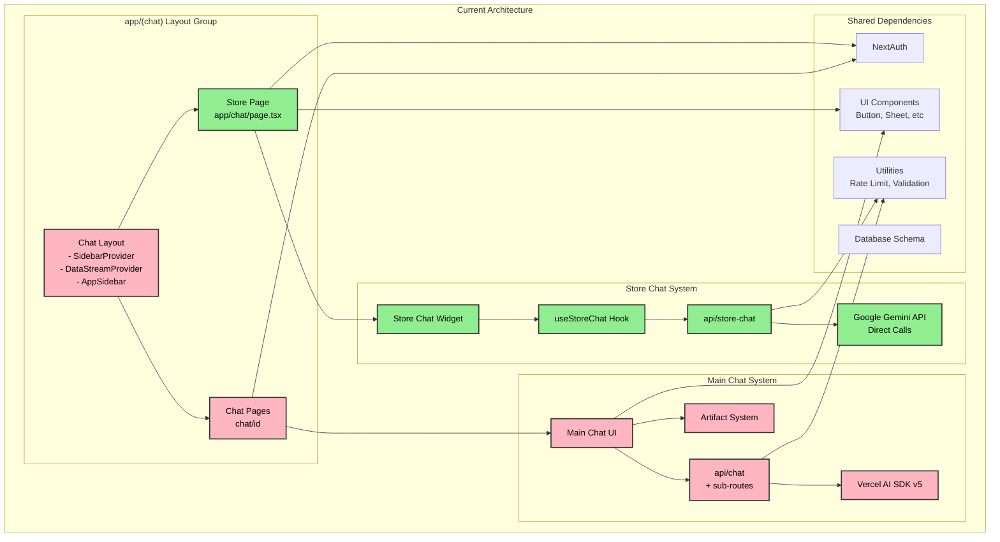
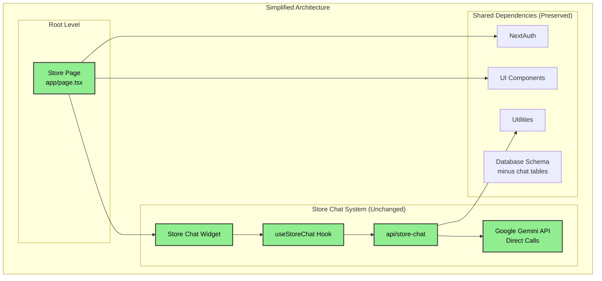

# Chat Systems Dependency Diagram

## Visual Architecture Overview

## Proposed Architecture (After Separation)

## Key Insights

### 🟢 Green = Keep (Store System)
- Completely independent implementation
- Direct Google Gemini API integration
- No Vercel AI SDK dependencies
- Works perfectly as-is

### 🔴 Red = Remove (Main Chat System)
- Heavy Vercel AI SDK v5 beta dependencies
- Causes all the TypeScript/build issues
- Not used by your store functionality
- 51+ files can be removed

### 🔵 Blue = Shared (Must Preserve)
- Authentication system (both use it)
- Basic UI components (Button, Sheet)
- Utility functions (rate limiting, validation)
- Some database tables

## The Critical Issue

**The store page is inside the (chat) layout group**, which wraps it with:
- SidebarProvider (not used by store)
- DataStreamProvider (not used by store)
- AppSidebar component (not shown on store page)

This is purely an organizational issue, not a functional dependency.

## Simple Solution

1. **Move** `/app/(chat)/page.tsx` → `/app/page.tsx`
2. **Delete** entire `/app/(chat)/chat` directory
3. **Delete** `/app/(chat)/layout.tsx`
4. **Remove** AI SDK packages from package.json
5. **Keep** everything in green above

This removes 51+ files and all the problematic beta dependencies while keeping your working store chat completely intact.